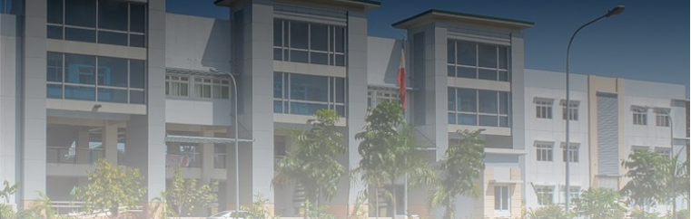

# Hi, I'm Justine Jay D. Tayting
### 2nd Year Computer Science Student | CCA

---

## About Me

I’m **Justine Jay D. Tayting**, a 2nd year Computer Science student at CCA.  
- 🌱 Currently learning **Python**  
- ✅ Already learned **C, Java**  
- 🎯 Goal: improve my coding skills and build meaningful projects  
- 🎧 Hobbies: music, coding, and gaming 

---

## Areas of Interest
- Software development  
- Data structures and algorithms  
- Networking basics  

### Programming Languages
- C  
- Java  
- Python (learning)

---

## Task/Project Links

- **(MIDTERM) Paired Task 1** – Object Oriented Analysis
  
  README: [Link Here](https://github.com/tayting05/7OOP-Lab-Task/blob/main/MIDTERM/Paired%20Task%201/README.md)

---

## Fun Facts About Me
- I study better with music 🎶  
- I like improving small projects step by step  

---

## Contacts
- [Facebook](https://facebook.com/tayting05/)
- [Instagram](https://instagram.com/tayting05/)
- [Tiktok](https://tiktok.com/@tayting05/)
- [LinkedIn](https://linkedin.com/in/justine-jay-tayting-406aa6332/)  
- [Email](jtayting24-1435@cca.edu.ph)

---

Thanks for visiting 🚀

